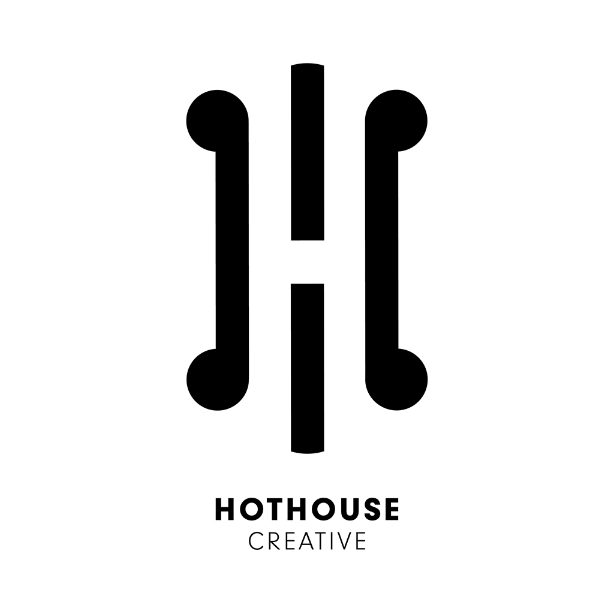

# Role
Developing websites using PHP, Javascript and MySQL stack in Silverstripe CMS
environment. Work included liaising with clients to functionality of proposed websites and corresponding price points. Also joint lead in the linux server environment (Bash) using Virtualmin maintaining sites, email servers etc.

## Technologies: 
Silverstripe (PHP), Dev Ops (Linux Server Bash, Virtualmin), JS, SASS, HTML

## Company
[Hothouse](https://www.hothouse.co.nz/) are ‘Designers for Business’, providing full graphic design and branding, promotion and web design, development and hosting services to our valued clients nationwide, and around the world.

