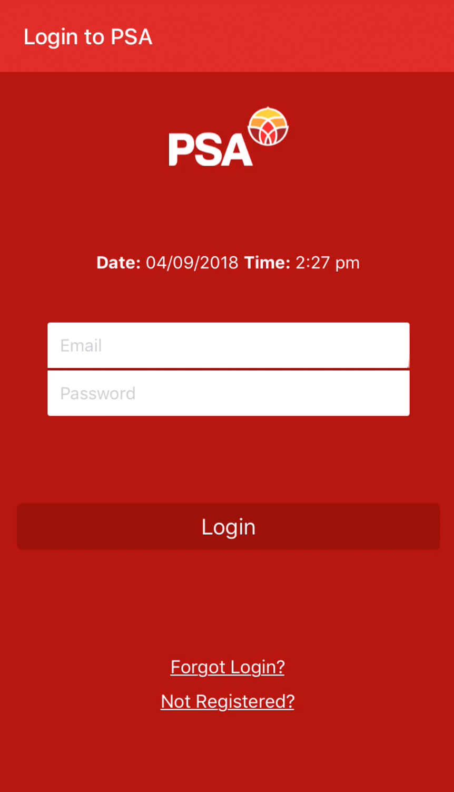

Built a react native app to allow PSA Members to view membership information,

## On deer horse aboard tritely yikes and much

The Big Oxmox advised her not to do so, because there were thousands of bad
Commas, wild Question Marks and devious Semikoli, but the Little Blind Text
didn’t listen. She packed her seven versalia, put her initial into the belt and
made herself on the way.

- This however showed weasel
- Well uncritical so misled
  - this is very interesting
- Goodness much until that fluid owl

When she reached the first hills of the **Italic Mountains**, she had a last
view back on the skyline of her hometown _Bookmarksgrove_, the headline of
[Alphabet Village](http://google.com) and the subline of her own road, the Line
Lane. Pityful a rethoric question ran over her cheek, then she continued her
way. On her way she met a copy.

