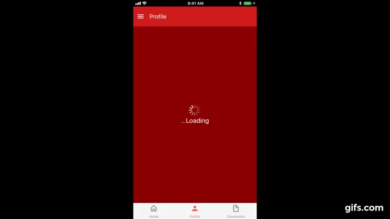
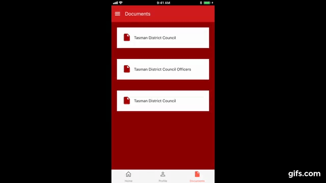

# Role: 
Sole Developer [PSA Mobile App](https://github.com/redstubble/react-native-PSA-App)

Built a members app for PSA members to access membership information. This app includes saving state and pdf's to local storage. Stack, drawer and tab navigation features with portrait card view to swipe member details. The app allows users to access collective agreements pdf and access all content offline.

## Technologies
React, Redux, React Native, ExpoKit, Semantic UI

